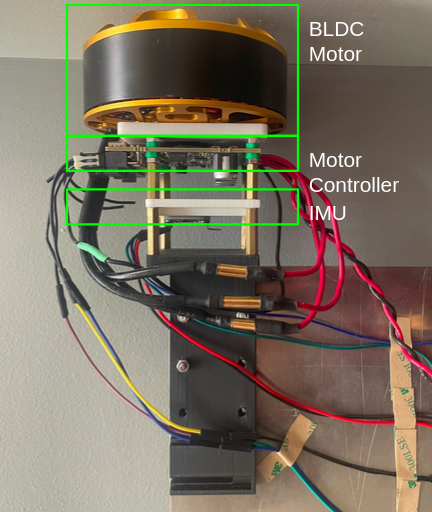
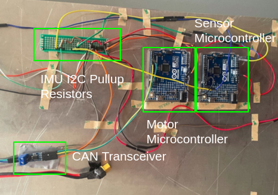

# FlexSat-Hardware

## Hardware Setup:

* Obtain a battery (Turnigy 4S 14.8V 5000mAh, XT90 connector) for each motor

  * There should be another motor assembly in the lab for experiments with the two motor setup.
* Attach assembly to the mocap cage

  * Hold the aluminum plate perpendicular to a column in the mocap cage
  * Loosely fix the pipe clamps around the pipes
  * Tighten the pipe clamps with a Philips Head screwdriver
  * Make sure the final assembly is level, the final fit should be very snug

## Systems Overview:

### Motor Assembly

* The assembly is held together by M3 screws and standoffs. Reaching components for replacement (such as the motor) or manually adjusting (such as the IMUs) can be done with a small Philips screwdriver
* Ensure that the plastic spacers are attached such that the board does not short circuit due to how close metal components are to the PCB.

### Wiring Assembly

* Ensure the custom battery connector (XT90 -> XT60) is appropriately attached to the motor controller and the battery is secured
* Ensure the DuPont wires are attached to the microcontrollers and none have fallen out or bent
  * Pin connections can be found in the appropriate .ino files

## Initializing an Experiment:

1. Plug the motor(s) into battery power
2. Plug a computer into the motor controller using a USB type C cable
3. Initialize motor calibration as velocity control and testing using this link: https://gui.odriverobotics.com/

   * This should be done already and save over different sessions. However, testing the motors to check calibration ONLY would be helpful
   * More details for debugging: https://docs.odriverobotics.com/v/latest/interfaces/gui.html
4. Remove the USB cable from the motor controller
5. Attach two separate USB cables to the two separate microcontrollers
6. Test IMU data collection with the file FrequencyScheduler.ino
7. Test motor actuation with MotorTesterSingleArduino.ino, this should not rely on any IMU measurements.

## Running an Experiment:

1. Configure the scripts and USB connections

* MotorDualArduino.ino
* FrequencyScheduler.ino
* HW_Data_Collection.m

  * This file has more information about possible USB port configurations for the corresponding microcontrollers
  * If this is different for the host computer, ensure this matches the USB configuration in the Arduino IDE.

2. Run the experiment

* Ensure the serial port to the MATLAB script holds priority by running this file first

  * Reset both microcontrollers by using the RESET buttons on the boards
  * Data from the IMU measurements will be stored in sysid_array in MATLAB
  * Copy the data and reformat as needed for sysid experiments

## Possible Debugging:

Issue: Motors refuse to calibrate correctly in the ODrive GUI (mismatch in the number of poles on the motor)

* The Hall effect magnet for the onboard encoder is misaligned
* Not enough power is reaching the motor controller
* The motor controller is shorting on metal components of the assembly (unlikely)
* The three cables from the motor are making electrical contact (unlikely)

Issue: The MATLAB script runs for~30 iterations at 100 Hz

* One of the arduinos is not functioning; check MessageHandler.m -> fix arduino
* Also: don't print anything to the serial line when the arduinos are running

Issue: Microcontrollers communication issues with MATLAB

* Close the Arduino IDE, unplug both usb connectors, plug the cables back in, then run the MATLAB script
